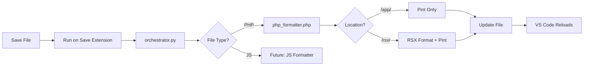

# 🚀 RSX Development Environment Setup

Welcome to the RSX Framework project! This guide will help you set up automatic code formatting in VS Code.

## Quick Start (Automatic)

When you open this project in VS Code for the first time:

1. **VS Code will prompt you** to install recommended extensions
   - Click "Install All" when prompted
   - The most important one is `Run on Save` by emeraldwalk

2. **A setup check will run automatically**
   - A terminal window will open to check your environment
   - If dependencies are missing, you'll see installation instructions
   - Follow the platform-specific instructions shown

3. **That's it!** Your files will now auto-format when you save them

## Platform-Specific Notes

### Windows Users
- The setup uses PowerShell scripts
- If you see "python3 not recognized", the setup will guide you
- You may need to use `python` instead of `python3`
- Chocolatey is recommended for easy installation

### macOS/Linux Users
- The setup uses bash scripts
- Homebrew (macOS) or apt/yum (Linux) instructions provided
- Usually `python3` is available by default

## What Gets Formatted

The formatter behaves differently based on file location:

| Location | Behavior |
|----------|----------|
| `/app/*.php` | Laravel Pint formatting only |
| `/rsx/*.php` (with class) | Full RSX formatting: namespace, use statements, LLM directives, + Pint |
| `/rsx/*.php` (no class) | Laravel Pint formatting only |
| Other locations | No formatting |

## Prerequisites

The formatter needs these tools installed on your system:

### Required
- **Python 3.6+** - Runs the formatter orchestrator
- **PHP 7.4+** - Parses and formats PHP files

### Optional
- **Node.js 14+** - For JavaScript/CSS formatting (coming soon)

### Quick Install Commands

<details>
<summary><strong>Windows (Chocolatey)</strong></summary>

```powershell
# Install Chocolatey first if needed
# https://chocolatey.org/install

# Then install tools
choco install python3 php nodejs -y
```
</details>

<details>
<summary><strong>macOS (Homebrew)</strong></summary>

```bash
# Install Homebrew first if needed
/bin/bash -c "$(curl -fsSL https://raw.githubusercontent.com/Homebrew/install/HEAD/install.sh)"

# Then install tools
brew install python@3 php node
```
</details>

<details>
<summary><strong>Ubuntu/Debian</strong></summary>

```bash
sudo apt update
sudo apt install python3 python3-pip php-cli nodejs npm -y
```
</details>

## Manual Setup Steps

If automatic setup doesn't work:

### 1. Install VS Code Extension

1. Open Extensions panel: `Ctrl+Shift+X` (Windows/Linux) or `Cmd+Shift+X` (Mac)
2. Search for: `emeraldwalk.runonsave`
3. Click Install

### 2. Check Dependencies

Run in VS Code terminal:
```bash
python3 .vscode/formatters/check_dependencies.py
```

### 3. Install Laravel Pint

```bash
composer require laravel/pint --dev
```

### 4. Test the Formatter

1. Open any PHP file in `/app/` or `/rsx/`
2. Add some messy formatting (extra spaces, etc.)
3. Save with `Ctrl+S` / `Cmd+S`
4. File should be auto-formatted!

## Troubleshooting

### "python3: command not found" (Windows)

Edit `.vscode/settings.json` and change:
```json
"cmd": "python3 ${workspaceFolder}/.vscode/formatters/orchestrator.py ${file}"
```
to:
```json
"cmd": "python ${workspaceFolder}/.vscode/formatters/orchestrator.py ${file}"
```

### Formatter not working

1. Check VS Code Output panel: `View` → `Output` → Select "Run on Save"
2. Test manually:
   ```bash
   python3 .vscode/formatters/orchestrator.py path/to/file.php
   ```

### Files not auto-reloading

VS Code should detect external changes automatically. If not:
- Click outside VS Code and back to force a check
- Or use `Ctrl+Shift+P` → `File: Revert File`

## VS Code Commands

Access these via `Ctrl+Shift+P` / `Cmd+Shift+P`:

- **Tasks: Run Task**
  - `RSX: Check Formatter Dependencies` - Check what's missing
  - `RSX: Setup Formatter (First Run)` - Run setup wizard
  - `RSX: Test PHP Formatter` - Test on current file
  - `RSX: Install Laravel Pint` - Install Pint package

## How It Works



## Contributing

To add support for new file types:

1. Create a formatter in `.vscode/formatters/`
2. Update `orchestrator.py` to call it
3. Update this documentation

## Need Help?

1. Run the setup wizard: `Tasks: Run Task` → `RSX: Setup Formatter`
2. Check dependencies: `python3 .vscode/formatters/check_dependencies.py`
3. Read the detailed guide: `.vscode/formatters/README.md`

---

**Happy coding!** The formatter will help maintain consistent code style across the project. 🎉